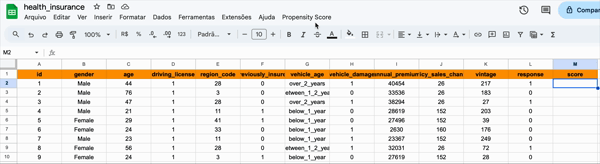

# Health Insurance Cross-Sell

## Visão Geral do Projeto

Empresas de seguros frequentemente enfrentam o desafio de ampliar sua base de produtos por cliente. Este projeto visa resolver um problema real: **identificar clientes com maior propensão a adquirir um seguro automotivo**, com base em dados de clientes que já possuem seguro de saúde.

**Objetivo**: Priorizar, com base em dados históricos, os 2.000 clientes com maior chance de conversão para uma nova oferta de seguro.

**Resultado-chave**:  
> Modelo preditivo integrado a uma planilha no Google Sheets, permitindo à equipe comercial acessar a lista de clientes com **maior potencial de compra** e **aumentar a eficiência de campanhas**.

## Ferramentas e Tecnologias

- **Python 3.10**  
- **Pandas, Numpy** – Manipulação de dados  
- **Scikit-learn** – Modelagem e métricas de performance  
- **Matplotlib & Seaborn** – Visualização de dados  
- **Google Sheets API** – Deploy para uso comercial  
- **Regressão Logística** – Modelo base  
- **Target e One-Hot Encoding, Standard Scaler**

## Dataset

**Descrição**: Base de dados contendo características demográficas e comportamentais de 127 mil clientes de seguro saúde. Um subconjunto respondeu se compraria um novo produto de seguro de carro.

**Principais atributos utilizados**:
- `age`, `annual_premium`, `vintage`
- `vehicle_damage`, `vehicle_age`
- `region_code`, `policy_sales_channel`
- `previously_insured`
## Estratégia de Solução

1. **Entendimento do Problema**  
   Modelagem baseada em pesquisa com parte dos clientes, focada em prever a probabilidade de conversão para os demais.

2. **Engenharia de Atributos**  
   - Codificação de variáveis categóricas  
   - Normalização de variáveis contínuas  
   - Geração de atributos relevantes com base em padrões comportamentais

3. **Seleção de Variáveis**  
   Seleção de atributos com maior impacto na decisão de compra usando técnicas estatísticas e heurísticas.

4. **Modelagem e Avaliação**  
   Modelo de **Regressão Logística** treinado com validação por métricas de rankeamento:
   - **Top-K Accuracy Score**
   - **Lift Curve**, **ROC Curve**
   - **Commutative Curve**

5. **Conversão de Score em Valor de Negócio**  
   Priorizar os 2.000 clientes com maior Propensity Score, respeitando o limite operacional do time comercial.

6. **Deploy**  
   Criação de um sistema simples e eficiente no **Google Sheets** que permite à equipe comercial acessar os dados atualizados automaticamente.

## Insights de Dados

- Clientes entre **30 e 50 anos** têm maior taxa de propensão.
- Histórico de **veículo danificado** indica maior interesse em seguros.
- O canal de vendas (`policy_sales_channel`) influencia significativamente a decisão de compra.

## Modelo de Machine Learning

- **Algoritmo**: Regressão Logística
- **Métrica Foco**: Top-k Accuracy Score
- **Objetivo**: Classificar clientes em ordem de probabilidade de conversão
- **Desempenho**:
  - Boa generalização
  - Excelente interpretabilidade
  - Integração simples com ferramentas comerciais

## Resultados de Negócio

- Geração da **lista priorizada dos 2.000 clientes com maior potencial de compra**
- Projeção de **taxa de conversão acima de 10%**
- Redução do custo por aquisição via campanhas mais direcionadas

## Competências Demonstradas

- **Machine Learning aplicado a Negócios**
- **Conversão de modelos em soluções práticas**
- **Engenharia de Atributos e Pré-processamento**
- **Integração de modelo em ferramentas operacionais (Google Sheets API)**
- **Storytelling com dados e foco em ROI**

## Próximos Passos

- Testar algoritmos mais robustos como **XGBoost ou Redes Neurais**
- Incluir variáveis comportamentais adicionais (ex: interações online)
- Otimização dinâmica das campanhas com base no feedback de resultados reais
